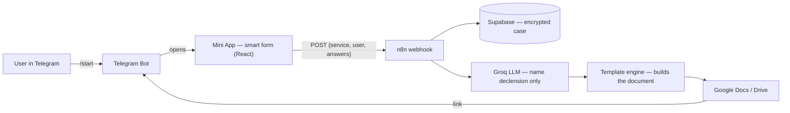

# Legal-AI ⚖️

> A Telegram Mini App that turns a routine legal task into a 5-minute, self-serve flow:
> fill in a smart form → get a court-ready document. No lawyer needed for templated cases.

**Status:** MVP / pre-launch (validating with first users via a partner lawyer) ·
**Market:** Ukraine (family & military law) → EU (Ukrainian migrants) ·
**Stack:** React + n8n + Supabase + Groq + Google Docs

---

## The idea

Most everyday legal documents — divorce petitions, child-support claims, mobilization
deferrals, housing-damage compensation — are **templated**. Yet people still pay lawyers
₴3,000–10,000 to fill in the blanks. Legal-AI automates the **document-preparation** part:
the user answers questions in Telegram and receives a finished document in ~30 seconds,
from ₴349. A human lawyer is brought in **only** where the law genuinely requires judgment.

Two sides of the same automation:

- **For citizens (B2C):** the end result — a ready document — not "find a lawyer".
  Fixed price shown upfront, the process explained step by step.
- **For lawyers (B2B / B2B2C):** automate routine drafting, scale templated cases without
  growing the team, monetize the complex ones, and act as the quality guarantee
  ("reviewed by a lawyer" + honest escalation).

---

## How it works



The form is data-driven: each service is a JSON `form_config` in Supabase (fields, tabs,
conditional `show_if` logic), so new services are added as configuration, not new code.

---

## The key engineering decision — hybrid generation

Legal documents must be **court-ready**, and LLMs happily hallucinate statute numbers.
So Legal-AI does **not** let an LLM write the document. Instead:

- **~95% is a deterministic template engine.** Law articles, structure, conditional
  clauses and attachments are hard-coded and **unit-tested** — they cannot be invented.
- **The LLM (Groq, `temperature: 0`) does one narrow thing:** decline Ukrainian
  full names and institution names into the correct grammatical cases (Ukrainian
  morphology), and return JSON.

Result: statute references can't be fabricated, output is testable, per-document LLM
cost ≈ $0. This *"know when **not** to use AI"* choice is the heart of the project —
and the open engineering problem it raises (how do you **measure** generation quality
for non-deterministic output?) is tracked as an evals backlog.

---

## Automation zones (driven by legal risk)

| Zone | Who does the work | When | Examples |
|------|-------------------|------|----------|
| 🟢 **Full automation** | ~99% machine, no human | fact → document by a deterministic algorithm | RACS divorce, child support (court order), standard deferral, housing compensation |
| 🟡 **Hybrid (AI + human)** | AI drafts → lawyer reviews/signs | legal judgment needed at the end | divorce with children, ТЦК appeal, non-standard EU permit |
| 🔴 **Human only / escalation** | AI steps aside, refers to a lawyer | subjective court assessment, criminal | custody, contested property split, medical-board lawsuits |

---

## Services

| Service | Audience | Automation | Status |
|---------|----------|-----------|--------|
| Divorce petition (with/without children) | spouses | 🟢/🟡 | **live** (template engine) |
| Child support (alimony) | single parents | 🟢 | **live** (template engine) |
| Divorce via RACS (no children) | spouses, by consent | 🟢 | planned |
| Standard mobilization deferral | exempt categories | 🟢 | planned |
| Housing-damage compensation (єВідновлення) | property owners | 🟢 | planned |
| EU legalization (DE / PL / CZ permits) | Ukrainians in the EU | 🟡 | Phase 2 (2027 deadline) |

---

## Market (short)

- **Ukraine, now:** divorce, alimony, deferrals, housing compensation — hundreds of
  thousands of requests/year; ₴300–1,500 per document. Existing players are static
  template generators (no conditional logic, no AI); marketplaces solve "find a lawyer"
  badly. The gap is "**get the document**".
- **EU, the big bet:** Temporary Protection ends **4 March 2027** → ~4M Ukrainians in
  the EU must legalize (DE ~1.2M, PL ~950K, CZ ~380K). A deadline-driven mass market with
  **no commercial document-generation product** for Ukrainians in PL/DE today.

See `docs/research/` and `docs/strategy/` for the full analysis.

---

## Tech stack

| Layer | Tools |
|-------|-------|
| **Client** | React 19 + Vite 7, TypeScript (strict), TailwindCSS, Framer Motion, `@twa-dev/sdk` → Vercel |
| **Orchestration** | n8n (self-hosted): form → AI → Google Doc → Telegram; business logic in Code nodes |
| **Database** | Supabase (PostgreSQL) + pgvector; RLS; AES-256-GCM PII encryption |
| **AI / LLM** | Groq (llama-3.3-70b) for declension; Google Gemini embeddings for RAG (hybrid vector + FTS over Ukrainian law) |
| **Documents** | Google Docs API (templating) + Drive API (delivery) |
| **Distribution** | Telegram Bot + Mini App |
| **Infra (planned)** | Hetzner CX22 (Docker + nginx) for self-hosted n8n |

---

## Repository structure

```
apps/
  client/          React/Vite — Telegram Mini App + admin panel (→ Vercel)
n8n/
  workflows/current/   active workflows (form-submit, main-bot)
  templates/           Code-node scripts (+ tests)
  prompts/             LLM prompt text
supabase/
  migrations/      SQL migrations (sequential, RLS, encryption, retention)
specs/             Spec-Driven Development: mission, tech-stack, roadmap, features/
docs/
  strategy/        vision, positioning, market materials
  research/        market research, JTBD, competitor analysis
  architecture/    DECISIONS, ARCHITECTURE, IMPROVEMENTS (backlog), guides
  runbooks/        operational how-tos (secrets, deploy)
scripts/           repo-level utilities (law monitor, deploy, decrypt, scaffold)
test-data/         fixtures + golden files for document generation
```

---

## Security & data protection

- **PII encrypted at rest** (AES-256-GCM, versioned format `v1:iv:tag:ct`) before it
  reaches the database.
- **Row-Level Security** on Supabase: case/identity data is service-role only.
- **Secrets** live in `.env.local` (gitignored) / Vercel env vars / n8n credentials —
  never in code.
- An ongoing security & architecture audit and its findings are tracked in
  `docs/architecture/IMPROVEMENTS.md`.

---

## Local development

The client app:

```bash
cd apps/client
npm install
npm run dev          # Vite dev server
npm run test         # vitest (document builders, form logic)
npm run lint
```

n8n runs locally via Docker; Telegram webhooks are exposed through a tunnel
(ngrok / cloudflared). See `docs/runbooks/` for the full local setup.

---

## Documentation

| Topic | Where |
|-------|-------|
| Mission, scope, principles | `specs/mission.md` |
| Tech stack & constraints | `specs/tech-stack.md` |
| Roadmap (phases) | `specs/roadmap.md` |
| Architecture decisions | `docs/architecture/DECISIONS.md` |
| Backlog & known issues | `docs/architecture/IMPROVEMENTS.md` |
| Market & user research | `docs/research/` |
| Strategy & vision | `docs/strategy/` |

---

*Ukrainian Legal AI — generating court-ready documents so people don't pay for templated work.*
