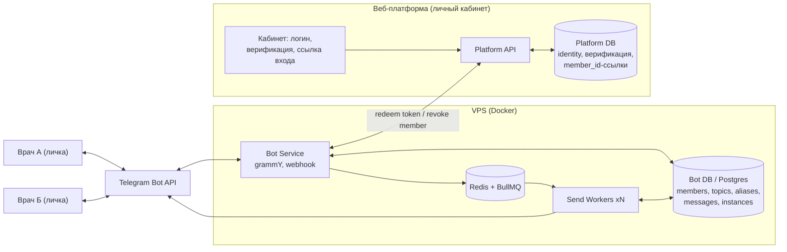
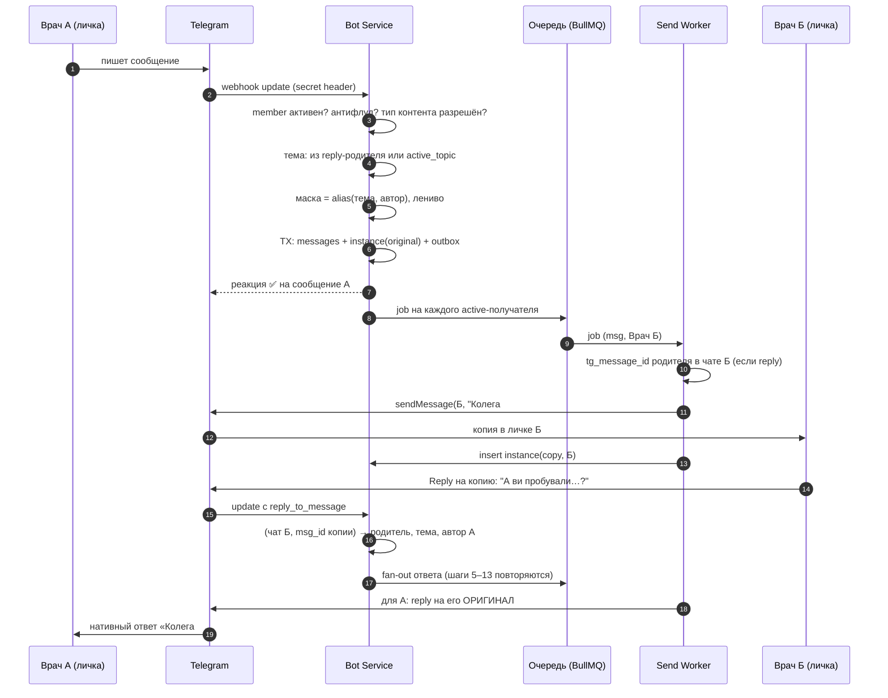

# Анонимный ретранслятор в Telegram — концепт архитектуры

**Статус:** концепт для обсуждения (2026-07-11). Это не спека — здесь зафиксировано «как устроено и почему», без разбивки на задачи.
**Контекст:** закрытое сообщество верифицированных специалистов (пример — врачи), участники анонимны друг для друга. Самостоятельная система, но идейно вписывается в вектор med-ФОП как community-фича.

---

## 1. TL;DR

- Паттерн — «анонимный ретранслятор»: один бот работает как почтовый сервер. Все пишут боту в личку, бот переизлучает сообщение всем участникам от имени маски («Колега #14»).
- Ядро системы — разделение «логического сообщения» и его «физических копий»: таблицы `messages` + `message_instances`. Reply резолвится обратным поиском по `(chat_id, message_id)`, рассылается прямым поиском «копия этого сообщения у получателя R».
- Псевдонимы: случайный свободный номер на пару (тема, участник), присваивается лениво при первом сообщении в теме. Никаких счётчиков по порядку вступления и никаких функций от user_id.
- Стек: TypeScript + grammY (webhook) + Redis/BullMQ (fan-out под лимиты Telegram) + PostgreSQL. Docker на VPS.
- Честно про «абсолютную анонимность»: она достижима **от других участников**. Оператор платформы и сам Telegram технически могут связать маску с аккаунтом — Bot API не имеет E2E-шифрования. Риск снижаем разделением знаний между двумя БД и минимизацией данных, но не устраняем.
- Главные каналы деанонимизации — не ID, а контент: голосовые, кружки, метаданные файлов, кастомные стикеры, стилометрия. Нужна контент-политика на входе.

---

## 2. Почему ретранслятор и что диктует Telegram

Альтернативы, которые не работают:

| Вариант | Почему нет |
|---|---|
| Обычная группа/супергруппа | профиль автора виден у каждого сообщения |
| Форум-топики в супергруппе | то же самое + виден список участников |
| «Анонимные админы» | доступно только админам группы, не участникам |
| Канал + комментарии | комментаторы видны; список подписчиков утекает админам |

Остаётся личка с ботом + программная ретрансляция. Prior art: open-source **secretlounge-ng** — тот же паттерн (анонимный lounge-бот); стоит изучить перед написанием кода, там собраны грабли лет эксплуатации.

Ограничения Bot API, которые формируют архитектуру:

- **~30 сообщений/сек на бота суммарно**, ~1 сообщение/сек в один чат (короткие всплески допустимы). Превышение → HTTP 429 + `retry_after`. Вывод: рассылка только через очередь с лимитером, никаких `for` вокруг `sendMessage`.
- **Deep-link** `t.me/<bot>?start=<payload>`: payload ≤ 64 символа `[A-Za-z0-9_-]`. Вывод: токен — 32 случайных байта в base64url (43 символа), а не JWT (не влезет).
- В личке **chat_id == telegram user_id**. Боту необходим chat_id, чтобы вообще отправлять сообщения → полная «безличность» на стороне бота невозможна by design; можно только защищать это поле (см. §3).
- Бот **не видит** прочтения (нет read receipts), онлайн-статусы, список «кто открыл ссылку».
- Редактировать свои отправленные сообщения бот может (`editMessageText`); удаление ограничено (окно ~48 ч) → «удаление» проектируем как редактирование в надгробие «🗑 повідомлення видалено».
- **Paid Broadcasts** (оплата Stars) поднимают потолок до ~1000 msg/s — готовый путь масштабирования без шардинга ботов.

---

## 3. Модель угроз: от кого именно анонимность

Слово «абсолютная» требует честной таблицы. Проектируем от неё.

| Наблюдатель | Что может увидеть | Чем защищаемся |
|---|---|---|
| Другие участники | только маску и контент | маски per-topic; контент-политика; `protect_content` на рассылках |
| Утечка БД бота | tg_chat_id ↔ маски ↔ контент | в этой БД **нет ФИО и верификации**; tg_chat_id — hash для поиска + шифртекст для отправки; retention контента |
| Утечка БД платформы | ФИО ↔ верификация ↔ member_id | в этой БД **нет tg_id и контента** |
| Обе БД вместе (сговор/компрометация) | полная деанонимизация | раздельный доступ и хостинг, аудит-лог, процедура раскрытия «в четыре глаза» |
| Telegram / законный запрос к нему | всё: Bot API не E2E, трафик бота проходит через серверы Telegram открытым для платформы текстом | **не решается этим дизайном** — фиксируем честно; если модель угроз включает Telegram, нужна другая технология (не этот проект) |
| Анализ поведения | стилометрия, время активности, самораскрытие («я работаю в клинике X в Ужгороде») | техникой не решается: правила сообщества, onboarding-инструктаж, модерация |

**Разделение знаний (split-knowledge)** — центральная идея защиты от оператора:
- БД платформы знает: «доктор Иванова, верифицирована, ей принадлежит member `7f3a…`».
- БД бота знает: «member `7f3a…` — это tg-аккаунт 123456789, писал в темах X, Y».
- Связывает их только пара `member_id`. Полная деанонимизация требует доступа к обеим базам одновременно — по одной утечке атакующий получает либо «какие врачи в системе» (и так знает клиника), либо «какие анонимные tg-аккаунты что писали» (без имён).

**Отдельно про врачей:** анонимность врача ≠ анонимность пациента. Врач под маской всё равно может нарушить врачебную тайну, описав узнаваемый случай. Это правовой риск платформы → в правила сообщества и onboarding: «без ПИБ, дат рождения и узнаваемых деталей пациентов».

**Контент-политика по умолчанию** (каждый пункт — реальный канал утечки):
- ✅ текст, фото (Telegram сжимает фото и срезает EXIF);
- ❌ голосовые (голос = биометрия), видео-кружки (лицо), документы/файлы (метаданные автора внутри), пересылки (заголовок «Forwarded from»), кастомные стикеры и premium-эмодзи (редкий стикерпак = отпечаток).
- Запрещённые типы бот отклоняет на входе с объяснением, они не уходят в рассылку.

---

## 4. Компоненты и границы



Роли компонентов:

- **Личный кабинет (web)** — тонкий: регистрация, верификация врача (на старте можно вручную), кнопка «Войти в сообщество» → одноразовая ссылка, отзыв доступа. Позже: управление темами, модерация, биллинг. Кабинет **никогда** не видит tg_id и контент.
- **Bot Service** — приём webhook-апдейтов, валидация, маппинг, постановка рассылки в очередь. Stateless.
- **Send Workers** — единственное место, где вызывается `sendMessage`; глобальный лимитер, ретраи, запись instances. Stateless, масштабируются горизонтально.
- **Две БД** — физически раздельные (минимум: разные проекты/серверы с разными доступами; на MVP допустимы две схемы с разными ролями Postgres, но это осознанный компромисс).

---

## 5. Контроль доступа: жизненный цикл токена

```mermaid
sequenceDiagram
    autonumber
    participant U as Врач
    participant LK as Кабинет (web)
    participant P as Platform API
    participant B as Bot Service

    U->>LK: логин + пройдена верификация
    LK->>P: выдать ссылку входа
    P->>P: token = rand(32B); store sha256(token), TTL 15 мин, single-use
    P-->>U: t.me/anon_bot?start=&lt;token&gt;
    U->>B: /start &lt;token&gt; (нажал ссылку в Telegram)
    B->>P: POST /internal/redeem {token}
    P->>P: hash найден? не истёк? не использован? → пометить used
    P-->>B: 200 OK
    B->>B: upsert member(tg_chat_id), status=active
    B-->>P: member_id (платформа сохраняет для будущего revoke)
    B-->>U: онбординг: правила, /topics
```

Свойства:

- Токен одноразовый, TTL 10–15 минут, на платформе хранится только SHA-256 (утечка БД платформы не даёт входных билетов).
- Платформа узнаёт `member_id`, но не tg_id; бот узнаёт факт «токен валиден», но не личность. Split-knowledge начинается прямо здесь.
- **Отзыв:** кабинет (или админ) → `POST /internal/revoke {member_id}` → бот ставит `status=revoked`, рассылки к участнику прекращаются, его сообщения больше не принимаются.
- Edge cases: повторный `/start` с использованным токеном → вежливый отказ «возьмите новую ссылку в кабинете»; смена tg-аккаунта = revoke старого member + новый токен; `/start` без payload → инструкция про кабинет.
- Канал Bot ↔ Platform API — внутренний: mTLS или подписанный service-token, в публичный интернет не смотрит.

---

## 6. Вопрос 1 — Message ID Mapping

### Проблема

Одно высказывание существует в N чатах, и в каждом — со своим `message_id`. Когда Б делает Reply, Telegram сообщает боту только: «в чате Б ответили на message_id=511». Боту нужно понять: какое это логическое сообщение, кто его автор, в какой оно теме — и как показать этот ответ каждому получателю так, чтобы у него reply указывал на **его** копию.

### Решение: два уровня

- `messages` — одна строка на высказывание (логический уровень).
- `message_instances` — одна строка на каждый чат, где это высказывание физически существует (физический уровень). Исходное сообщение автора — тоже instance (`kind=original`), поэтому автор адресуем наравне со всеми: когда кто-то отвечает автору, воркер подставит reply на его собственный оригинал.

### Схема данных (Bot DB)

```sql
create table members (
  member_id       uuid primary key default gen_random_uuid(),
  tg_chat_id      bigint not null unique,
  status          text   not null default 'active',
  role            text   not null default 'member',
  active_topic_id uuid,
  created_at      timestamptz not null default now()
);

create table topics (
  topic_id   uuid primary key default gen_random_uuid(),
  title      text not null,
  status     text not null default 'open',
  created_at timestamptz not null default now()
);

create table aliases (
  topic_id  uuid not null references topics,
  member_id uuid not null references members,
  alias_num int  not null,
  primary key (topic_id, member_id),
  unique (topic_id, alias_num)
);

create table messages (
  msg_id           uuid primary key default gen_random_uuid(),
  topic_id         uuid not null references topics,
  author_member_id uuid not null references members,
  reply_to_msg_id  uuid references messages,
  kind             text not null default 'text',
  body             text,
  created_at       timestamptz not null default now(),
  edited_at        timestamptz,
  deleted_at       timestamptz
);

create table message_instances (
  msg_id        uuid   not null references messages,
  member_id     uuid   not null references members,
  tg_chat_id    bigint not null,
  tg_message_id bigint not null,
  kind          text   not null,
  primary key (msg_id, member_id),
  unique (tg_chat_id, tg_message_id)
);
```

Примечания:
- `members.tg_chat_id` — самое чувствительное поле. Хардненинг: хранить `sha256(chat_id || pepper)` для поиска + шифртекст для отправки (ключ вне БД). На MVP допустимо plaintext + шифрование диска, но поле не должно попадать в логи/бэкапы без шифрования.
- `messages.body` — текст или telegram `file_id` (для фото). Вычищается retention-джобой (см. §10); скелет треда (`messages` без body + `instances`) можно держать дольше ради работы reply.
- `kind` в instances: `original` (исходник в чате автора) | `copy` (копия, отправленная ботом).

### Два ключевых запроса

Обратный поиск — «на что ответил Б» (вход: чат Б + `reply_to_message.message_id` из апдейта):

```sql
select m.msg_id, m.topic_id, m.author_member_id
from message_instances i
join messages m using (msg_id)
where i.tg_chat_id = :sender_chat_id
  and i.tg_message_id = :reply_to_message_id;
```

Уникальный индекс `(tg_chat_id, tg_message_id)` делает это O(1). Результат отвечает на оба вопроса из задачи: **какое** сообщение (msg_id) и **чьё** оно (author_member_id).

Прямой поиск — «каким message_id родитель лежит у получателя R» (для нативного reply при рассылке):

```sql
select tg_message_id
from message_instances
where msg_id = :parent_msg_id and member_id = :recipient_member_id;
```

### Доставка с reply (код воркера, суть)

```ts
// jobId = `${msgId}:${recipientId}` — идемпотентность при ретраях
async function deliver({ msgId, recipientId }: Job) {
  if (await instances.exists(msgId, recipientId)) return; // уже доставлено (ретрай после падения)
  const msg = await messages.get(msgId);
  const parentTgId = msg.replyToMsgId
    ? await instances.tgMessageId(msg.replyToMsgId, recipientId) // null, если получатель вступил позже
    : null;
  const sent = await bot.api.sendMessage(chatIdOf(recipientId), render(msg), {
    reply_parameters: parentTgId
      ? { message_id: parentTgId, allow_sending_without_reply: true }
      : undefined,
    protect_content: true,
  });
  await instances.insert({ msgId, recipientId, tgMessageId: sent.message_id, kind: 'copy' });
}
```

Как это выглядит у получателя (UI украинский):

```
🧵 Ліцензування · Колега #14
Колеги, хтось проходив перевірку після зміни адреси кабінету?
```

а ответ — нативным reply с цитатой родителя:

```
↩︎ Колега #14: «Колеги, хтось проходив перевірку…»
🧵 Ліцензування · Колега #7
Проходив у березні, розкажу по кроках.
```

### Edge cases маппинга

| Ситуация | Поведение |
|---|---|
| У получателя нет instance родителя (вступил позже / retention вычистил) | `allow_sending_without_reply: true` + текстовая шапка «↪️ у відповідь Колезі #14» и сниппет ~100 символов |
| Reply на сервисное сообщение бота (онбординг, ошибки) | трактуем как обычное сообщение в активной теме |
| Автор отредактировал оригинал (`edited_message` update) | находим msg через original-instance → `editMessageText` по всем copy через ту же очередь; это ещё ~N вызовов API, поэтому окно редактирования ограничиваем (напр. 15 мин) |
| Автор удаляет: `/delete` реплаем на своё сообщение | best-effort `deleteMessage` копий (лимит 48 ч) + редактирование остальных в «🗑 повідомлення видалено автором»; `deleted_at` в messages |
| Получатель заблокировал бота (403 при отправке) | `status=paused`, из рассылок исключается; вернётся — `/start` реактивирует |
| Reply пришёл на сообщение из закрытой (archived) темы | сообщение отклоняем с подсказкой «тема закрита» |

Подтверждение автору, что сообщение ушло в эфир — **реакция ✅** на его сообщение (`setMessageReaction`): ноль лишних сообщений в чате и никакого эха.

---

## 7. Вопрос 2 — маски/псевдонимы

### Требования

1. Стабильность внутри темы: «Колега #14» в теме — один и тот же человек.
2. Невычислимость: из маски нельзя получить личность ни перебором, ни утечкой ключа.
3. Несвязываемость между темами: иначе за месяцы накапливается профиль «Колеги #14» (стиль + время активности + оговорки), и корреляционная атака деанонимизирует без всяких ID.

### Антипаттерны (почему «очевидные» решения плохи)

- **Счётчик по порядку вступления/поста** (`#1`, `#2`, …): #1 — основатель, маленькие номера — «старожилы». Утечка социальной структуры.
- **alias = f(tg_user_id)** без ключа: перебор по известным user_id восстанавливает соответствие.
- **HMAC(key, user_id ‖ topic_id)**: рабочий вариант, но (а) коллизии в маленьком числовом пространстве всё равно требуют хранения разрешений, (б) компрометация одного ключа деанонимизирует **все маски задним числом**, включая уже удалённые темы. Ключ становится единой точкой отказа приватности.

### Рекомендация: ленивое случайное присвоение с хранением

```ts
async function getAlias(topicId: string, memberId: string): Promise<number> {
  const existing = await aliases.find(topicId, memberId);
  if (existing) return existing.aliasNum;
  for (;;) {
    const n = 1 + secureRandomInt(999); // криптослучайный источник
    try {
      await aliases.insert({ topicId, memberId, aliasNum: n }); // unique(topic_id, alias_num)
      return n;
    } catch (e) {
      if (!isUniqueViolation(e)) throw e; // коллизия — просто перебрасываем кубик
    }
  }
}
```

Почему это лучше:

- Уникальность гарантирует констрейнт БД, а не математика — коллизий не существует по построению.
- Никакого ключа, компрометация которого раскрывает всё: связь есть только в таблице `aliases`, и она защищена так же, как members (split-knowledge: в ней всё равно нет ФИО).
- **Ленивость — бесплатный бонус приватности:** маска появляется при первом *сообщении* в теме. Молчаливые читатели не получают маску вообще — их существования не видно остальным.
- Новая тема → новый случайный номер → требование несвязываемости выполняется автоматически.

Опции по вкусу:

- Диапазон 1..999 при <1000 активных авторов на тему; расширить тривиально.
- Читаемые маски «прилагательное + существительное» («Синій Сокіл», «Тихий Дуб») — удобнее следить за диалогом многих участников; тот же алгоритм, другой словарь. Конфиг-флаг.
- Флаг «глобальная маска» (один псевдоним на все темы) — даёт репутацию, но включает корреляцию между темами. Осознанный трейдофф, по умолчанию выключен.

### Пределы масок

Маска скрывает метаданные, но не содержание. Стилометрия, время активности и самораскрытие остаются (§3) — это зона правил и модерации, техника тут бессильна. Именно поэтому контент-политика (без голосовых/кружков/файлов) — часть дизайна анонимности, а не «фича на потом».

---

## 8. Вопрос 3 — жизненный цикл сообщения



По шагам:

1. **А отправляет сообщение** в личку боту. Telegram доставляет update на webhook; проверяем заголовок `X-Telegram-Bot-Api-Secret-Token`, мгновенно отвечаем 200 (обработка асинхронная — иначе Telegram начнёт ретраить).
2. **Авторизация:** member по chat_id существует и `active`? Нет → подсказка про кабинет.
3. **Антифлуд:** например ≥3 сек между сообщениями, всплеск ≤5/мин; нарушение → мягкое предупреждение, сообщение не рассылается.
4. **Контент-фильтр:** тип разрешён (§3)? Голосовое/кружок/файл/пересылка → отказ с объяснением.
5. **Тема:** если это reply — тема родителя (обратный поиск §6); иначе `active_topic` участника (переключается через `/topics`, по умолчанию «Загальна»).
6. **Маска:** `alias(topic, author)` — существующая или новая случайная (§7).
7. **Одна транзакция:** `insert messages` + `insert message_instances(kind=original)` + запись в outbox. Транзакционный outbox гарантирует: сообщение либо целиком «существует и будет разослано», либо нет.
8. **Подтверждение автору:** реакция ✅ на его сообщение.
9. **Диспетчер** превращает outbox-запись в BullMQ-джобы: по одной на каждого `active`-участника кроме автора; `jobId = msgId:memberId` (идемпотентность).
10. **Воркеры** шлют под глобальным лимитером (~25 msg/s, запас к лимиту 30): для каждого получателя резолвят **его** `tg_message_id` родителя → `sendMessage` с `reply_parameters`; 429 → пауза `retry_after`; 403 → `status=paused`; успех → `insert instances(kind=copy)`.
11. **Б получает** «🧵 Тема · Колега #14: …» и жмёт **Reply**. В апдейте — `reply_to_message.message_id` копии в чате Б.
12. **Резолв:** `(chat_id Б, message_id)` → instance → msg_id родителя → тема + автор А. Ответ Б проходит те же шаги 5–10. Воркер для А подставит reply на **оригинал А** — А видит нативный ответ на своё сообщение. Остальные видят reply на свои копии. Ответ публичен для всей комнаты — личных веток нет (анонимный 1:1 — отдельная фича с отдельными рисками харассмента, в MVP не берём).

**Латентность fan-out** (фундаментальное ограничение одного бота): при ~25 msg/s — 100 получателей ≈ 4 с, 500 ≈ 20 с, 2000 ≈ 80 с. Порядок сообщений на получателя сохраняем FIFO-очередью. Потолок раздвигается Paid Broadcasts (до ~1000/s за Stars), шардинг по нескольким ботам — крайняя мера, ломает UX.

---

## 9. Вопрос 4 — стек и масштабирование

| Слой | Выбор | Почему |
|---|---|---|
| Bot service | Node.js + TypeScript + **grammY**, webhook-режим | твой основной стек — TS (client, n8n-скрипты); зрелый фреймворк: middleware, плагин auto-retry для 429, типизация Bot API |
| Очередь | **Redis + BullMQ** | rate-limit из коробки, ретраи с backoff, идемпотентные jobId, воркеры масштабируются горизонтально |
| БД | **PostgreSQL** | mapping-таблицы — классическая реляционка; старт можно на Supabase (знаком), но контент чувствителен → отдельный проект с узким доступом, по мере роста self-host |
| Платформа/кабинет | существующий стек (React/Vite + тонкий API) | кабинет тонкий: верификация, токены, revoke; не изобретать |
| Деплой | Docker Compose на VPS (Hetzner — уже в планах под n8n) | ingress + workers + redis + postgres; всё stateless кроме БД |

Альтернатива по языку: Python + aiogram 3 — эквивалентна по возможностям; выбор TS чисто из-за твоего окружения. Serverless (Workers/Lambda) для ingress возможен, но очередь с глобальным лимитером и порядком проще и дешевле держать на VPS.

**Почему не n8n:** ядро (fan-out с лимитерами, транзакционный outbox, идемпотентность, mapping) — это продуктовая логика с жёсткими гарантиями доставки; в n8n она будет хрупкой и медленной (state между нодами, throughput, ретраи на середине рассылки). n8n остаётся для периферии: нотификации админам, интеграции кабинета.

**Надёжность:**
- Транзакционный outbox: `messages` и задание на рассылку пишутся в одной транзакции; диспетчер перекладывает в BullMQ; упали между — sweep-джоба доберёт.
- Идемпотентность: `jobId = msgId:memberId` + проверка `instances.exists` перед отправкой. Окно «отправили, упали до insert» остаётся (редкий дубль у одного получателя) — принимаем.
- Дедупликация входа: watermark по `update_id`. Telegram сам ретраит webhook при 5xx и держит очередь апдейтов до ~24 ч — падение сервиса не теряет сообщения.
- Наблюдаемость **без PII**: метрики (глубина очереди, 429/мин, p95 доставки), логи только с UUID — ни контента, ни tg_id.

**Ёмкость одного бота** (реалистичные цифры): 500 участников × 200 сообщений/день = 100k отправок/день ≈ 1.2 msg/s в среднем — комфортно. Пиковая задержка — §8. До ~2–5 тыс. участников архитектура не меняется; дальше Paid Broadcasts.

---

## 10. MVP-срез и открытые вопросы

**MVP:** одна «комната», темы + `/topics`, текст и фото, маски per-topic, токен-вход + revoke, `/rules`, `/stop` (пауза себе), `/delete`, `/report` (реплаем; модератор видит те же маски), retention контента 30 дней, кабинет-минимум (верификация вручную + кнопка со ссылкой).

**Открытые вопросы** (кандидаты на `/interview` перед спекой):

1. История для новичков: показывать ли вступившему последние N сообщений темы? (= хранить контент дольше; приватность vs удобство)
2. Медиа-политика: точно ли нужны фото в MVP? Голосовые — запрет навсегда или «расшифровка в текст» позже?
3. Процедура деанонимизации: при каких событиях (угрозы, криминал) и кем вскрывается связка двух БД; юридическое оформление.
4. Модерация: пре-модерация первых сообщений новичка? авто-фильтры (ПИБ пациентов, телефоны)?
5. Комнаты по специальностям (терапевты/стоматологи) — вторая размерность membership; в схеме заложено (room_id над topics), в MVP не включаем.
6. Уведомления и mute: `/mute тема` чтобы не тонуть в потоке; дайджесты вместо realtime для тихих участников.
7. Биллинг: вход по подписке платформы (2k грн/мес med-ФОП) или отдельный продукт?

**Следующий шаг:** прочитать концепт → обсудить открытые вопросы → `/interview` на MVP-спеку → issue.
