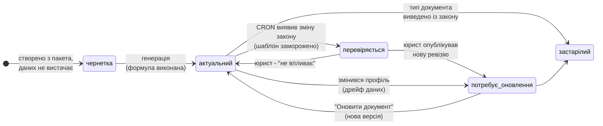
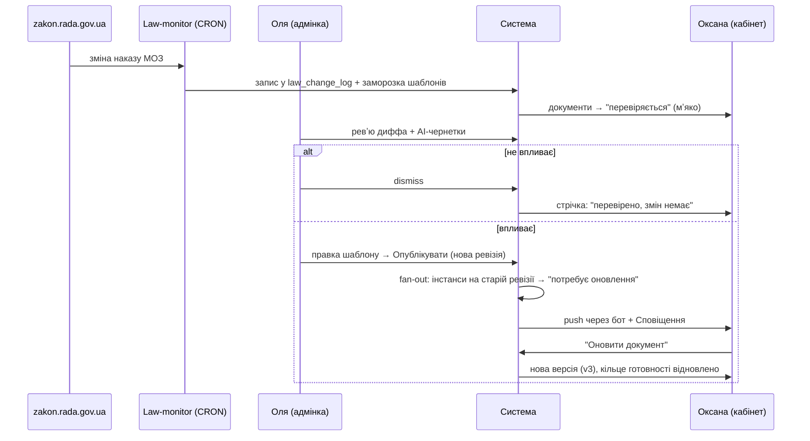

# Особистий кабінет медичного ФОП — концепція «живих документів»

> **Статус:** концепція для обговорення (сесія 83, 2026-07-11). Не спека, не обіцянка — предмет дискусії з Олею (юрист) і дядею (Tech Lead).
> **Аудиторія:** Сергій (рішення) · Оля (юридична валідація) · дядя (оцінка інженерної доцільності).
> **Супутній артефакт:** кликабельний макет [cabinet-mockup.html](cabinet-mockup.html) — 6 екранів + симуляція зміни закону.
> **Мова:** тіло — російська, продуктові терміни та UI — українська.

---

## 1. Резюме (один экран)

**Боль.** Медицинский ФОП покупает у юриста пакет документов для лицензии (~250€). Пакет устаревает с первого дня: 20+ законов и наказов МОЗ меняются, юристы недописывают, инцидент или проверка → штрафы и риск лицензии. Юрист адаптирует пакет каждому клиенту вручную — это не масштабируется и не обновляется.

**Продукт.** Подписочная платформа (~2000 грн/мес): **живая база документов ФОПа** — всегда актуальная (документы автоматически помечаются при изменении закона и обновляются в один тап), новости законодательства под профиль практики, уведомления, поддержка юриста, анонимное сообщество врачей.

**Рынок.** SAM ≈ **35 462** медицинских ФОП (дедуплицированный Лицензионный реестр Держликслужбы). 3% проникновения @ 2000 грн/мес ≈ **25,5 млн грн/год (~$615k ARR)**. Детали: market-size бриф (ветка `docs/med-vertical-market-brief`, файл `docs/research/med-vertical/market-size-brief.md` — до merge читать через `git show`).

**Почему подписка, а не разовая продажа.** «Анатомия» вертикали = официальный чек-лист самопроверки лицензионных условий: **122 вопроса × степень риска × юридическое основание**, привязанных к 20+ законам, с ежегодной рисковой проверкой. Комплаенс — потребность постоянная и повторяющаяся, в отличие от разового семейного иска.

**Ключевой факт для Tech Lead.** Бэкенд-ядро «живости» уже работает в продакшене: мониторинг законов (CRON по zakon.rada.gov.ua), авто-заморозка затронутых шаблонов, AI-черновик влияния для юриста, версии шаблонов, сервис-агностичный рендер документов. Кабинет — это **новая поверхность + ~6 новых таблиц**, а не новая система (§8).

---

## 2. Ринок і болі

Полный расчёт — в market-size брифе. Здесь только несущие цифры:

| Показатель | Значение |
|---|---:|
| Живых лицензий на медпрактику | ≈ 59 148 |
| **SAM: медицинские ФОП (без ЄДРПОУ)** | **≈ 35 462** |
| TAM: весь частный сектор (ФОП + частные клиники) | ≈ 49 000 |
| Частные клиники-юрлица (потенциальный B2B-тариф, отдельная гипотеза) | ≈ 23 686 |
| SOM 1–3 года (1–5% SAM) | 355 – 1 773 клиентов |
| Выручка @ 2000 грн/мес, 3% SAM | ≈ 25,5 млн грн/год (~$615k ARR) |
| Топ-5 «тыловых» областей (Київ, Дніпро, Львів, Харків, Одеса) | ≈ 23 400 лицензий = 40% базы → beachhead |

Боли (из встречи с Олей + логика чек-листа; валидировать интервью, §11):

1. **Пакет устаревает молча.** Врач не знает, что его «Положення про медичний кабінет» уже не соответствует новому наказу МОЗ — узнаёт на проверке.
2. **Юристы недописывают.** Типовой пакет продаётся «как есть»; кейс «случился инцидент → оказалось, в документе не хватало пункта» — реальный паттерн.
3. **Адаптация вручную.** Каждому клиенту юрист перебивает ПІБ/адрес/специальность руками — дорого, медленно, с ошибками.
4. **Кадровый хвост.** ФОП с наёмными сотрудниками (медсёстры, администратор) должен держать комплект на каждого: трудовой договор, посадова інструкція, медогляди. Обычно это дыра.
5. **Страх проверки.** 122 пункта самопроверки × степень риска — врач не понимает, «готов» он или нет.

---

## 3. Ядро продукта: цикл «живих документів»

### 3.1 Актуальность — формула, а не флаг

Каждая сгенерированная версия документа хранит два указателя:

```
DocumentVersion
 ├─ template_revision_id   → какая ревизия шаблона её рендерила
 └─ answers_snapshot       → значения полей (профиль + дельта) на момент генерации
```

Документ **актуальний** тогда и только тогда, когда:

1. ревизия шаблона версии == текущая опубликованная ревизия шаблона, **И**
2. для каждого поля профиля, которое использует шаблон, текущее значение == значению в снапшоте.

Нарушение (1) = «изменился закон / юрист улучшил шаблон». Нарушение (2) = «изменились ваши данные» (переезд кабинета, новый сотрудник, смена режима работы). Оба ведут в статус «потребує оновлення», но с разной причиной в UI.

Это симметрия, которую юрист-конкурент не может дать руками: staleness ловится **с обеих сторон** — со стороны законодательства и со стороны жизни клиента. И это делает «живость» проверяемым свойством системы, а не маркетинговым обещанием: все статусы, бейджи и скор дашборда *выводятся* из формулы.

### 3.2 Сквозной сценарий: Оксана, стоматолог, 5 сотрудников

1. **Вход.** Оксана попадает в бот (реклама/сарафан) → кнопка «Відкрити кабінет» → Mini App. Auth = Telegram initData — без паролей и регистрации.
2. **Онбординг = Профіль ФОПа.** Экран согласия на обработку данных (см. GDPR-условия, §10) → мастер из 4–5 шагов на существующем движке динамических форм: особисті дані + РНОКПП → діяльність (КВЕДи, спеціальність) → ліцензія (номер, наказ, види меддопомоги) → місце провадження + режим роботи → працівники (повторяемый блок: ПІБ, посада, дата прийому). Ответы пишутся в постоянный профиль, **не** в разовую заявку.
3. **Рекомендованный пакет.** Система пересекает профиль с каталогом шаблонов (у шаблона — правила применимости: «требует працівників», «только стоматология»…) → «Ваш пакет: 24 документи»: організаційні (9) · кадрові (3 × 5 сотрудников = 15) · журнали (4, часть в v1.1). Кнопка «Сформувати пакет».
4. **Генерация без перепечатывания.** Поля каждого документа закрываются из профиля автоматически; если шаблону нужно что-то сверх профиля — короткая дельта-форма (обычно 2–5 полей). До заполнения документ висит «чернетка».
5. **Жизнь идёт.** Через месяц CRON ловит изменение наказа МОЗ → запись в лог изменений, затронутые шаблоны замораживаются. *Это уже работает сегодня* — проверено вживую 06.07.2026 (авто-заморозка сервиса divorce при изменении Семейного кодекса). Документы Оксаны получают мягкий статус «перевіряється юристом».
6. **Юрист — шлюз к пользователю.** Оля в админке видит дифф закона + AI-черновик влияния. Два исхода: (а) «не влияет» → dismiss, пользователи видят максимум строку в ленте «перевірено: змін для вас немає» (доверие); (б) «влияет» → правит шаблон в Service Builder → «Опублікувати» создаёт новую ревизию → **fan-out**: все документы всех клиентов на старой ревизии переходят в «потребує оновлення»; Оля пишет 2 предложения человеческим языком для ленты.
7. **Уведомление.** Каждому затронутому клиенту: push через бот («⚠️ Змінився Наказ МОЗ №… Це стосується 2 ваших документів») + запись в персистентном центре «Сповіщення».
8. **Оновлення в один тап.** Оксана открывает документ → баннер причины → «Оновити документ» → регенерация из сохранённого профиля + новой ревизии = **новая версия того же документа** (v3), старая уходит в историю. Если новая ревизия требует новое поле — сначала мини-форма только этого поля.
9. **Скачивание.** Только защищённая ссылка (signed URL, 24 часа) из приватного хранилища — файл в Telegram-чат не пушим (GDPR-констрейнт для меддокументов). История версий доступна всегда.
10. **Дашборд отражает.** Кольцо «Готовність до перевірки» упало на шаге 6 и восстановилось после шага 8 — Оксана *видит*, за что платит каждый месяц.

**Анти-спам-правило (принципиальное):** пользователь видит «потребує оновлення» **только после действия юриста** (публикации новой ревизии). Сырой автоматический детект даёт максимум «перевіряється». Иначе каждое косметическое изменение закона будит тысячу человек и обесценивает канал уведомлений. Существующий двухступенчатый конвейер (авто-заморозка → ревью юриста) уже реализует ровно эту семантику — кабинет наследует её на уровень документов.

### 3.3 Статусная модель документа



| Статус | Смысл | Бейдж |
|---|---|---|
| `чернетка` | входные данные неполны, версии ещё нет | серый |
| `актуальний` | формула §3.1 выполнена | зелёный |
| `перевіряється` | шаблон заморожен после детекта, вердикта юриста нет | янтарный, пульс |
| `потребує оновлення` | новая ревизия шаблона ИЛИ дрейф профиля — с причиной | оранжевый |
| `застарілий` | тип документа больше не требуется законом | серый, зачёркнут |
| `не потрібен` | пользователь осознанно отклонил рекомендацию (обратимо) | прозрачный |

У версий документа статусы простые: `поточна` / `архівна` (+ цепочка «замінює v2 від 12.03»).

### 3.4 Цикл целиком (sequence)



---

## 4. Карта модулів + інформаційна архітектура

Платформо-агностичное дерево (решение «Telegram Mini App vs web» сознательно не фиксируется — см. врезку ниже):

```
Кабінет
├── Головна «Моя практика»      ← кільце готовності, «потребує уваги», рядок довіри
├── Мої документи
│   ├── Організаційні
│   ├── Кадрові (за людьми)
│   └── Журнали та форми
│   └── [деталка: версії, підстава, оновлення]
├── Люди                         ← працівники + їхні комплекти документів
├── Законодавство                ← персоналізована стрічка змін
├── Сповіщення                   ← персистентний центр (дзвіночок у шапці)
├── Підтримка                    ← звернення + «юрист на замовлення»
├── Спільнота                    ← закрита TG-група (анонімно) + «Питання і пропозиції»
├── Профіль ФОПа                 ← єдине джерело даних для всіх документів
└── Підписка та оплати
```

**Рендеринг по платформам.** В Telegram Mini App: нижний таб-бар из 4 позиций — `Головна · Документи · Законодавство · Ще` (внутри «Ще»: Люди, Підтримка, Спільнота, Профіль, Підписка); «Сповіщення» — колокольчик с бейджем в шапке каждого экрана. В web-версии (позже): те же узлы дерева как сайдбар. Ни один модуль не «знает», таб он или пункт меню.

> **Где Telegram даёт рычаг (фиксируем факты, платформу не выбираем):**
> 1. push через бота = **бесплатный** канал с почти 100% доставкой — на нём стоит экономика уведомлений и retention;
> 2. initData = вход без регистрации и паролей — конверсия онбординга;
> 3. меню бота = ежедневная точка повторного входа;
> 4. бот-прокси = анонимность сообщества без строчки чат-кода.
> Web-версия становится нужна на ступени «бухгалтер/ТОВ» (§6): печать, большие таблицы, вторые роли.

### 4.1 Головна — «зачем я открываю это еженедельно»

Назначение: за 5 секунд ответить «у меня всё в порядке?» и дать один следующий шаг.

1. **Кольцо «Готовність до перевірки» — N%** + разбивка «Високий ризик: 1 незакрите · Середній: 4». Тап → полный чек-лист по разделам официальной формы, фильтр «лише незакриті». Механика — §5.
2. **Стек «Потребує уваги»** (максимум 3 + «усі»): документы «потребує оновлення» с причиной, непрочитанные релевантные изменения закона, дедлайны (медогляд Петренко О. — через 14 днів; v1.1).
3. **Строка доверия:** «Законодавство перевірено: сьогодні 06:15 · 20 законів під наглядом» — визуализация невидимой работы CRON. Дёшево и очень продающе: тишина тоже продукт, если показана как работа.
4. Быстрые действия: «+ Працівник», «Замовити документ», «Звернутися до юриста».

Empty state (онбординг не завершён): серое кольцо, «Заповніть профіль — і ми зберемо ваш пакет документів» + прогресс заполнения.

### 4.2 Мої документи

- **Список**: три группы (Організаційні / Кадрові / Журнали); кадровые сгруппированы по людям («Петренко О. — 3 документи»). Карточка: название, статус-бейдж, «версія від …». Фильтр-чипы по статусу, счётчики в шапках групп.
- **Деталка** — ключевой экран цикла:
  1. статус-баннер с причиной и CTA «Оновити документ»;
  2. превью документа;
  3. «Завантажити» (signed URL 24h);
  4. **Історія версій** (v3 поточна · v2 від 12.03 · v1 від 02.01 — каждая скачиваема);
  5. **Підстава**: какие законы держат этот документ + какие пункты чек-листа он закрывает («Закриває питання 41, 42 самооцінки»). Этого врач никогда не получал от юриста — главный аргумент цены.
- Empty state: «Документів ще немає. Заповніть профіль → отримаєте персональний пакет».

### 4.3 Люди

- Список сотрудников: ФІО, посада, индикатор комплекта («4/4 документи актуальні» / «1 потребує оновлення»), дата ближайшего медогляду (v1.1).
- Картка працівника: данные (правка триггерит staleness его документов — формула §3.1 работает и здесь), комплект документов, «Додати документ». Звільнення → комплект в «застарілі» + рекомендация «Наказ про звільнення» (v1.1: оффбординг — тоже документный поток).
- MVP: всем управляет владелец, никаких логинов сотрудников. Empty state: «Працюєте самостійно? Цей розділ не обовʼязковий» — снимает тревогу соло-ФОПа.

### 4.4 Законодавство

- Лента, отфильтрованная по профилю: пересечение изменений законов × шаблоны, которые есть/применимы у клиента. Карточка: закон, дата, короткое резюме Оли (поверх AI-черновика), плашка влияния: «Стосується 2 ваших документів →» / «Вас не стосується» / «Перевіряється юристом».
- Деталка: что изменилось человеческим языком → какие документы затронуты (ссылки) → что сделали мы («шаблон оновлено 14.07») → что делать вам («натисніть Оновити»).
- Empty state: «Змін, що стосуються вашої практики, поки немає. Ми перевіряємо щодня о 06:00».
- Не-подписчику — тизер: заголовки видны, тело и влияние под замком (§7).

### 4.5 Сповіщення

Персистентный центр: каждый push дублируется строкой (пуш эфемерен — центр обязателен). Типы: `law_change` / `doc_status` / `deadline` / `support_reply` / `community` / `billing`. Непрочитанные жирным, тап = переход в контекст. Настройки каналов по типам — v1.1.

### 4.6 Підтримка

- «Мої звернення» (треды) + «Нове звернення»; SLA-обещание («відповідаємо протягом робочого дня» — валидировать ёмкость Оли, §11).
- **«Юрист на замовлення»**: нестандартный документ/консультация за отдельные деньги. Механика повторяет существующую очередь заявок в админке — только теперь заявку подаёт клиент. Побочный эффект: 3 одинаковых заказа = сигнал «нужен шаблон в каталог» — воронка расширения каталога.

### 4.7 Спільнота

- Карточка закрытой TG-группы: правила, «як працює анонімність» (сообщения через бота-прокси, имя скрыто), кнопка вступить (проверка подписки перед выдачей invite-ссылки).
- **«Питання і пропозиції»**: структурированные запросы команде с голосованием (▲ 12) и статусами «розглядається / заплановано / зроблено / відхилено». Наш канал инсайтов и дешёвая замена продакт-рисёрчу.

### 4.8 Профіль ФОПа

- Секции: Особисті дані · Діяльність (КВЕДи, спеціальності) · Ліцензія · Адреси та режим · Банківські реквізити · Згоди (версии согласий, право отзыва) · Дані та приватність (экспорт архива, удаление — GDPR).
- У каждого поля — мета «використовується у 12 документах». Сохранение изменения → **предпросмотр волны**: «Це змінить 12 документів. Оновити зараз / пізніше» → массовая регенерация или массовый статус «потребує оновлення». Витрина механики живости — обязательна в макете.

### 4.9 Підписка та оплати

Статус плана, что входит (списком способностей человеческим языком), история платежей/рахунки, управление. Три сценария §7 — экран один и тот же, отличается состав блоков. MVP: «Отримати рахунок» + ручная активация админом — честно и достаточно для 20–30 пилотных клиентов.

---

## 5. «Готовність до перевірки»: чек-лист 122 как хребет

Официальный чек-лист самопроверки (122 вопроса лицензионных условий) превращаем из PDF в **данные**: каталог вопросов, у каждого — степень риска, правовое основание, правило применимости (по профилю) и **способ закрытия**:

| Способ | Как закрывается | Пример |
|---|---|---|
| `auto_doc` | автоматически наличием актуального документа типа X | «Положення про медкабінет» актуально → пункт закрыт |
| `profile` | выводится из профиля | «ліцензія є» — из секции Ліцензія |
| `self` | тумблер самооценки: так / ні / не стосується | «приміщення відповідає нормам» |

Скор = взвешенная сумма закрытых применимых пунктов (вес = степень риска). Часть пунктов неприменима по профилю (нет сотрудников → кадровый блок выпадает) — они не портят знаменатель.

**Двойная роль скора:**
- **Продукт:** крючок еженедельного захода + место, где падение (закон изменился) и восстановление (обновил документ) видимы — §3.2 шаг 10.
- **Лид-магнит:** чек-лист самооценки бесплатен во всех сценариях монетизации. «У вас відсутні 12 документів базового пакета» — самогенерирующийся спрос.

> ⚠️ **Риск (юридический, на sign-off Оли до показа наружу):** «готовність 92%» может быть прочитана как гарантия прохождения проверки → претензия «у меня было 92%, а меня оштрафовали». Митигируем: слово «самооцінка» в заголовке, дисклеймер под кольцом, формулировки утверждает Оля (§11, в.3). В MVP скор честный и узкий: «Повнота документної бази — 18/24» (только auto_doc + profile), полный интерактивный чек-лист — v1.1.

Не путать с существующим `required_checklist` в сервисах — это пост-рендер валидатор содержимого документа; здесь — каталог комплаенс-требований к практике.

---

## 6. Люди і масштабування

### 6.1 Инвариантное ядро

```
identities (telegram_id) ──→ profiles (людина, глобально)      [ІСНУЄ]
                                  │  membership (роль)          [НОВЕ]
                                  ▼
                             WORKSPACE (корінь володіння)       [НОВЕ]
                                  ├── BusinessProfile (SSoT даних практики)
                                  ├── Person[] (люди практики)
                                  ├── DocumentInstance[] → Version[]
                                  ├── ChecklistAssessment
                                  ├── Subscription / Entitlements
                                  └── Notification[]
```

Неизменное при любом масштабе: документы, люди, подписка и оценка принадлежат **workspace**; человек входит в workspace через membership с ролью. UI всегда рендерится в контексте «активный workspace × моя роль». В MVP это невидимо: один membership = owner.

### 6.2 Ступени роста

| Ступень | Дельта данных | Дельта UI | Что НЕ меняется |
|---|---|---|---|
| **Соло-ФОП** (MVP) | kind=`fop_med`, 1 membership | «Люди» = мягкий empty state | всё ядро |
| **ФОП + штат** (MVP) | строки Person; `subject_person_id` у документа | кадровые группируются по людям, индикаторы комплектов | схема та же с 1-го дня |
| **Кілька місць провадження** (v2) | сущность Location; `location_id?` у документа; журнали per location | фильтр/переключатель адреса | формула актуальности |
| **ТОВ + роли** (v2) | kind=`tov` (свои секции профиля: ЄДРПОУ, директор); много membership: owner / hr / accountant / admin | приглашения; видимость модулей по роли (HR → Люди+кадрові; бухгалтер → Підписка) | документы, версии, чек-лист, лента |
| **Клиника B2B** (будущее) | kind=`clinic`, seats в entitlement, role=`advisor` (внешний юрист, read-only) | тариф/лимиты, брендинг | вся механика цикла |

Три ключа к «без ремоделирования»:
1. **membership существует с первого дня** (просто одна строка);
2. **профиль схема-версионирован**: `kind` выбирает набор секций (ФОП: РНОКПП+ліцензія; ТОВ: ЄДРПОУ+директор), а пространство имён полей (`fop.*`, `org.*`, `employee.*`) — общее с шаблонами документов;
3. **права = матрица role × capability**, в MVP тривиальная (owner: всё).

---

## 7. Монетизація — 3 сценарія на одному механізмі (для обговорення)

**Механизм:** модули проверяют **способности** (`docs.generate`, `docs.download`, `docs.update`, `news.full`, `support.tickets`, `community.join`, …); резолвер собирает их из строк покупок/подписки. Сценарий монетизации = конфигурация резолвера, не переделка продукта.

**Бесплатно во всех сценариях:** профиль + онбординг, чек-лист самооценки + «готовність» (лид-магнит), каталог + превью с водяным знаком, экспорт своих данных (GDPR).

| Способность | A: разовый пакет | B: только подписка | C: гибрид |
|---|---|---|---|
| Генерация полного пакета | 💰 пакет | 🔒 подписка | 💰 «Стартовий пакет» (вкл. 1–3 мес супроводу) |
| Завантаження + история версий | 💰 навсегда | 🔒 | 💰 навсегда |
| **Оновлення при изменениях закона** | ❌ нет | 🔒 | 🔒 подписка «Супровід» |
| Лента «Законодавство» + push | тизер | 🔒 | 🔒 |
| Кадрові комплекти (Люди) | 💰 в пакете | 🔒 | 💰 пакет; оновлення 🔒 |
| Підтримка (тікети) | ❌ / разово | 🔒 | 🔒 |
| Юрист на замовлення | 💰 отдельно | 💰 отдельно | 💰 отдельно |
| Спільнота | ❌ | 🔒 | 🔒 (retention-крючок) |

**Поведение при уходе (churn):**
- A — документы куплены навсегда, обновлений нет (продукт вырождается в разовую продажу);
- B — read-only 90 дней → удаление с экспортом;
- C — документы остаются, баннер «Супровід призупинено — 2 документи могли застаріти». Это одновременно этичный и лучший win-back-экран в продукте.

**Аргументы за C (рекомендация, не решение):**
1. якорь 250€ уже существует в голове рынка — «Стартовий пакет» легче продать, чем абстрактную подписку;
2. подписка продаётся не абстракцией, а **страхом устаревания уже купленного актива**;
3. сценарий A убивает ядро продукта (без обновлений «живых документов» нет), сценарий B ставит порог 2000 грн/мес до первой ощутимой ценности.

Финальный выбор — после интервью с рынком (§11, в.13).

---

## 8. Що вже збудовано → що будуємо (розділ для Tech Lead)

### 8.1 Карта переиспользования

| Существующий движок (в продакшене) | Роль в Кабінете |
|---|---|
| `services.form_config` + `DynamicLegalFormBuilder` (динамические формы) | онбординг-мастер профиля; дельта-формы документов |
| `render-document.js` — сервис-агностичный рендер (работает в n8n и в браузере) | генерация всех документов пакета, дешёвые превью |
| `service_revisions` — версии шаблонов (миграция 031) | точка пиннинга `DocumentVersion.template_revision_id` |
| Law-monitor: CRON по zakon.rada.gov.ua → `law_change_log` (+AI-черновик влияния) → авто-заморозка сервисов | детектор цикла §3.2 — **готов, менять не надо**; проверен вживую 06.07 |
| Админка: Service Builder (формы + шаблон-редактор + ревизии + preflight), LawChangeLogPage, очереди заявок/заметок | производственный станок Оли: шаблоны, ревью законов, публикация в ленту, саппорт-инбокс |
| Бот: intent-dispatch, deep-link в Mini App, push | бесплатный канал уведомлений + точка повторного входа |
| Приватный Storage + signed URL 24h + AES-256-GCM шифрование PII | delivery и хранение версий документов (GDPR) |
| Consent-механика из GDPR-брифа (экран + таблица согласий, версионирование текста) | онбординг-гейт кабинета |

### 8.2 Новые сущности (концептуально, не SQL)

| Сущность | Статус | Заметка |
|---|---|---|
| Workspace, Membership | 🆕 | корень владения + роль (§6.1) |
| Profile / Identity | ✅ есть | остаются тонкими и глобальными (человек ≠ бизнес) |
| BusinessProfile («Профіль ФОПа») | 🆕 | мутируемый SSoT; шифрование по паттерну cases; версия схемы |
| Person («Люди») | 🆕 | workspace-scoped; поля `employee.*`; даты для дедлайнов |
| DocumentTemplate | 🔧 `services` | + doc_kind (організаційний/кадровий/журнал), subject_scope (workspace/person), правила применимости, ссылки на пункты чек-листа |
| TemplateRevision | 🔧 `service_revisions` | сегодня — снапшот-бэкап «до изменения»; нужно: publish создаёт ревизию + `services.current_revision_id` (аддитивно) |
| DocumentInstance / DocumentVersion | 🆕 | ядро живости: статус §3.3; `template_revision_id` + `answers_snapshot` + `storage_path` + `supersedes` |
| ChecklistItem / ChecklistAssessment | 🆕 | каталог 122 (админ-контент) / состояние workspace × пункт + evidence |
| LawChangeEvent | 🔧 `law_change_log` | + `user_facing_summary`, `published_at` — лента показывает только опубликованное юристом |
| Purchase / Subscription → Entitlement | 🆕 | резолвер способностей (§7); платёжный провайдер — v1.1 |
| Notification | 🆕 | персистентный центр |
| SupportTicket, FeatureRequest + Vote | 🆕 | по паттернам существующих очередей админки |
| Consent | 🆕 | по дизайну GDPR-брифа (версия текста, granted/withdrawn) |

### 8.3 Коллизия «cases vs живые документы» — решение

`cases` спроектирован как **разовый чек**: одна строка = один рендер, `paid` на строке, retention 90 дней кроном, нет понятия «тот же документ, новая версия». Живой документ ломает все четыре предположения: инстанс живёт пока жива подписка; оплата — уровнем выше (entitlement workspace); регенерация = новая версия **того же** логического документа; retention привязан к жизненному циклу подписки, а не к фиксированным 90 дням.

**Решение: `cases` не ретрофитим.** Старый B2C-поток (развод/алименты) продолжает работать на нём нетронутым; Кабінет пишет в новые таблицы; общее — движки (рендер, шифрование, бакеты, signed URL). Обязательный guard: **90-дневный retention-cron не должен видеть новые таблицы** — у кабинета своя retention-политика.

Отклонённая альтернатива: «профиль как первый case» — дешевле на старте, но case иммутабелен со своим TTL, а профиль — мутируемый SSoT с fan-out зависимостями; смешение ломает и retention, и статусную модель.

---

## 9. Фази та критерії валідації

### MVP — «первые 20–30 подписчиков» (валидация ценности, не выручки)

Состав: Головна (скор v0: «Повнота документної бази 18/24») · Мої документи (полный цикл §3.2) · Люди (список + комплекты) · Законодавство (кураторская лента) · Сповіщення (push + центр) · Профіль · Підписка (рахунок + ручная активация) · Спільнота (ссылка на группу + минимальные «Питання і пропозиції»).

1. Новые таблицы: Workspace, Membership, BusinessProfile, Person, DocumentInstance/Version, Notification, Consent, простой Entitlement + аддитивные колонки (`services.current_revision_id`, `law_change_log.user_facing_summary/published_at`).
2. Онбординг-мастер на существующем form-движке + consent-экран (условия GDPR-брифа выполнить до первого мед-клиента, включая уведомление Омбудсмана).
3. **Контент — критический путь, не код:** 6–10 шаблонов ядра пакета от Оли (через существующий Service Builder) + маппинг ~30 пунктов чек-листа на них. Без этого MVP не существует. Стартовать неделей №1, параллельно разработке.
4. Цикл: пакетная генерация, статусы, регенерация, fan-out при publish ревизии, push через бот.
5. Оплата: рахунок-фактура + ручной флип entitlement в админке. Платёжный провайдер — НЕ блокер валидации.
6. Auth: Telegram initData через n8n service-role (как сегодня). Per-user RLS — v1.1, до масштаба.

**Критерий валидации MVP:** ≥50% пилотных открывают кабинет повторно в течение месяца без пинка, И ≥1 полный цикл «закон → пуш → оновлення» прожит реальными пользователями.

### v1.1 — «продукт, за который платят картой»

Рекуррентный провайдер (WayForPay / LiqPay / Fondy — исследовать поддержку подписочных списаний для ФОП-мерчанта) · полный интерактивный 122-чек-лист + история скора · дедлайн-движок (медогляди, сроки договоров) · per-user RLS / end-user auth · настройки уведомлений · статусы «Питання і пропозиції» · экспорт архива · UX-полировка дельта-форм.

### v2 — «платформа»

ТОВ + роли + приглашения · кілька місць провадження · **«Режим перевірки»** (все актуальные документы одним архивом + чек-лист — киллер-фича момента паники «завтра перевірка») · интерактивные журнали · web-поверхность · B2B-тариф клиник · интеграции (автозаполнение профиля из открытых реестров) · инсайт-аналитика сообщества.

---

## 10. Ризики

| Риск | Митигация |
|---|---|
| **Контент-горлышко:** MVP убивает не код, а время Оли (6–10 шаблонов + маппинг чек-листа) | минимальный связный пакет (6, не 24 документа); Service Builder ей уже знаком; чек-лист в MVP — только auto_doc-часть |
| **Скор как обещание:** «92%» прочитано как гарантия → претензия после штрафа | «самооцінка» в заголовке + дисклеймер + формулировки на sign-off Оли до показа наружу |
| **Сырой AI в ленте** = риск доверия всего продукта | двухступенчатый конвейер (AI-черновик → Оля публикует) — не срезать ради скорости; в ленту попадает только `published_at IS NOT NULL` |
| **Платформенный риск Telegram** (блокировки, политика платежей) | IA платформо-агностична (§4); профиль привязан к identity, не к telegram_id напрямую — миграция на web-auth возможна |
| **GDPR/мед-данные** | условия брифа: consent-экран + таблица согласий + retention TTL + signed-link-only доставка + уведомление Омбудсмана (30 раб. дней до старта обработки) + регион Supabase |
| **Пустое сообщество** хуже отсутствия сообщества | группу открываем после первых ~20 подписчиков; до того — только «Питання і пропозиції» |

---

## 11. Відкриті питання

**Олі (юрист):**
1. Канонический состав минимального пакета: какие 6–10 документов — обязательное ядро для любого мед-ФОП, что варьируется по спеціальності? *(= содержание MVP)*
2. Маппинг 122 пунктов: какие закрываются документами, какие — только фактом (обладнання, приміщення)? Какая доля вообще покрываема нами? *(= потолок скора)*
3. Юридическая безопасность «готовності до перевірки»: формулировка, дисклеймер.
4. Посадова інструкція — именная или на посаду? Источники периодичности медоглядів?
5. Её пропускная способность part-time: N изменений законов/мес × ревью × summary + SLA поддержки «в течение рабочего дня» — реалистично?
6. ПД сотрудников, вносимые работодателем: правовая основа, наш статус (владелец/распорядитель), информирование работников.
7. Допустимо ли автообновление документа **без** её ревью для тривиальных изменений (реквизиты закона)?

**Дяде (Tech Lead):**
8. Enforcement entitlement: n8n-медиация (как сегодня) vs RLS vs edge functions — и когда переходить.
9. Auth-стратегия: Telegram-only до какого масштаба; привязка телефона на онбординге как страховка для web.
10. Рекуррентные платежи в UA: какой провайдер реально поддерживает подписочные списания для ФОП-мерчанта.
11. Политика хранения версий документов (объёмы тривиальны, вопрос продуктовый: сколько версий показывать/хранить).
12. Расширение AES-паттерна cases на BusinessProfile/Person: ключи, ротация.

**Рынку (10–15 интервью через Олю; совпадает с §7 market-брифа):**
13. Готовность платить 2000 грн/мес vs разовый пакет — какой сценарий §7 выигрывает у живых людей.
14. Что триггерит заход: плановая самооценка раз в год? объявленная перевірка? штраф коллеги?
15. Кто реально кликает: сам врач или его бухгалтер? *(= приоритет ролей/web)*
16. Ценность анонимности в сообществе — оправдан ли бот-прокси.

---

## Додаток А. Глосарій статусів (UI-терміни)

`чернетка` · `актуальний` · `перевіряється` · `потребує оновлення` · `застарілий` · `не потрібен` — документы (§3.3);
`поточна` / `архівна` — версии;
`розглядається` / `заплановано` / `зроблено` / `відхилено` — «Питання і пропозиції».

## Додаток Б. Джерела

- Market-size бриф: ветка `docs/med-vertical-market-brief` → `docs/research/med-vertical/market-size-brief.md` (до merge: `git show docs/med-vertical-market-brief:docs/research/med-vertical/market-size-brief.md`)
- GDPR/мед-данные бриф: ветка `research/gdpr-med-brief` → `docs/research/gdpr-med-data-brief-2026-07.md`
- Чек-лист самопроверки: `перелік_питань_для_самоперевірки.pdf` (официальный, 122 вопроса Лицензионных условий)
- Кликабельный макет: [cabinet-mockup.html](cabinet-mockup.html)
- Архитектурный контекст: `docs/strategy/service-builder-vision.md`, `docs/architecture/DECISIONS.md` (law-change-digest, бот-push), `docs/runbooks/law-monitor-cron.md`
